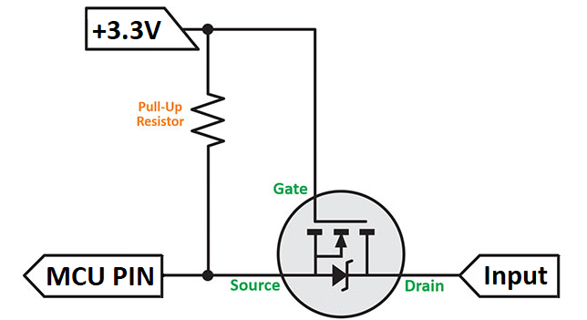
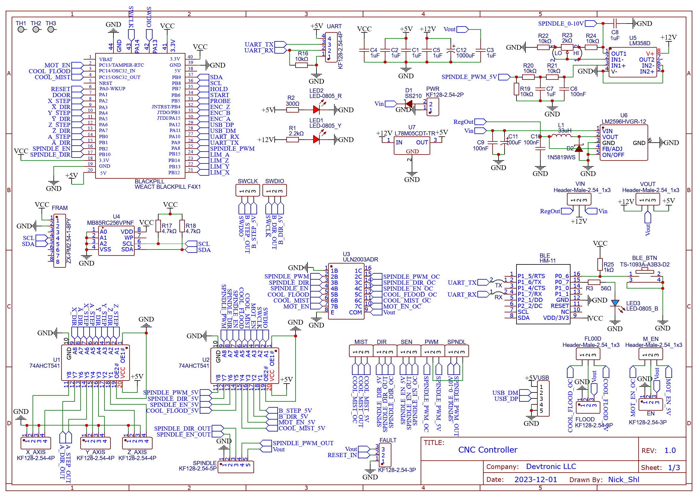
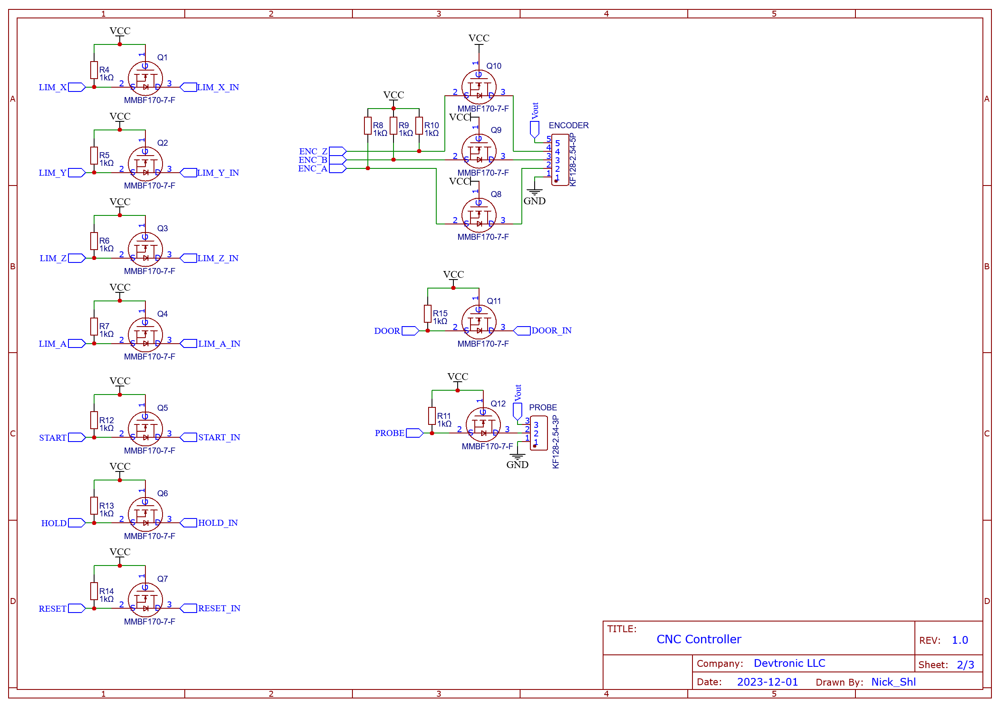
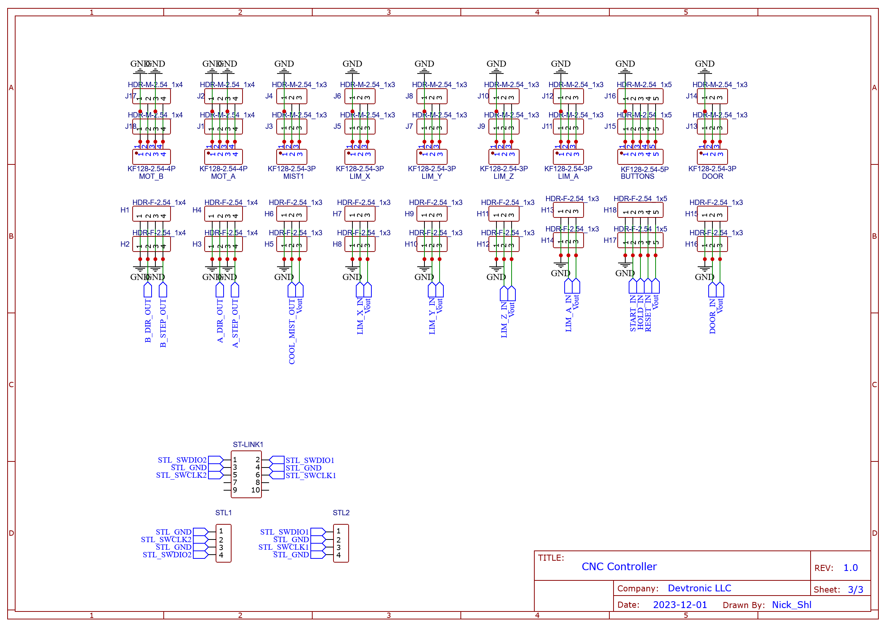

# Devtronic CNC Controller

Why one more controller needed? All controllers has connectors all over the PCB. As result, to make accurate wiring it require a lot of space. If we look on stepper motor drivers, all of them has connectors only on one side which allow to stack them as "sandwich". Why not design CNC controller like that? It exactly what Devtronic CNC Controller is:

This board is everything you need to build a high functioning CNC machine.

**Where to buy:** https://www.etsy.com/shop/Devtronic

The key features of the Devtronic CNC controller:

* Support [grblHAL](https://github.com/grblHAL)
* 5 Axis of step/direction motor control: 5V, external stepper driver required(closed-loop recommended)
* All inputs protected by transistor, NPN sensors should be used
* Onboard 32KB FRAM to store setting
* Input voltage up to 48V which allow to power CNC controller directly from power supply for NEMA23/24 stepper motors
* UART for control CNC machine with another controller

[grblHAL Web Builder](http://svn.io-engineering.com:8080/)

Configuration:

* Driver: **STM32F4xx**
* Board:  **Devtronic CNC Controller (BlackPill F411)**

## Dimensions

**120** mm x **66** mm x **24** mm
Approx. 4-3/4" x 2-5/8" x 1"

## Pinout

### Connectors on bottom row

* Power connector: configurable between 7-12V and 12-48V by jumper (-, +)
* X motor (Direction-, Direction+, Step-, Step+)
* Y motor (Direction-, Direction+, Step-, Step+)
* Z motor (Direction-, Direction+, Step-, Step+)
* Motor Enable output (Ground, Signal, Voltage)
* Spindle control (Ground, Enable, Direction, Speed, Voltage)
* Flood Coolant output (Ground, Signal, Voltage)
* Encoder input (Ground, A, B, Z, Voltage)
* Probe input (Ground, Signal, Voltage)
* UART (Ground, RX, TX, +5V)
* Fault input (Ground, Signal, Voltage)

###  Connectors on top row

* B motor (Direction-, Direction+, Step-, Step+)
* A motor (Direction-, Direction+, Step-, Step+)
* Flood Mist output(Ground, Signal, Voltage)
* X Limit input (Ground, Signal, Voltage)
* Y Limit input (Ground, Signal, Voltage)
* Z Limit input (Ground, Signal, Voltage)
* A Limit input (Ground, Signal, Voltage)
* Door input (Ground, Signal, Voltage)
* USB

## Inputs

All inputs protected using transistor.

When nothing or voltage higher than +3.3V applied to input, transistor is closed and doesn't allow high voltage from input pass trough to MCU pin. When ground level applied to the input, current start to flow trough transistor internal diode. It pulls MCU pin voltage to around +0.6V(voltage drop on diode), then because of voltage difference between source and gate, transistor opens completely which pulls voltage level MCU pin to practically ground level. More on that principle in [this article](https://www.digikey.com/en/blog/logic-level-shifting-basics).

Because of schematic, only **NPN sensors is recommended**. Sensors can have internal pull-up resistor.
If mechanical switch used as endstop it should connect input terminal to GND, not to +V.

## Configuration

There three configuration blocks of jumpers.

### Power control

This controller can be powered by three ways:

1. USB: Only +5V available, spindle analog control(0-10V) will not work.
2. +7-12V applied to PWR connector: Spindle analog control(0-10V) will work only if +12V applied.
3. +12-48V applied to PWR connector: Input voltage reduced to +12V via DC-DC Step-Down converter.

There two jumpers to control power:

* **VIN**: input voltage selector, PWR for input voltage +7-12V and REG for input voltage +12-48V. When powered only from USB it recommends to remove this jumper. Default is REG.
* **VOUT**: output voltage selector. Output voltage applied to all screw terminal marked as +V. It may be VIN voltage or +5V from linear regulator. UART connector always has +5V regardless of this jumper position. Default is +5V.

Note: default position when delivered to prevent damage in case of power up without checking settings. Those jumpers should be configured for particular build.

### Output control

Some outputs can be configured between Push-Pull(PP) or Open Collector(OC):

* **EN**: enable signal for steppers, default is PP.
* **COOLANT MIST**: default is OC.
* **COOLANT FLOOD**: default is OC.
* **SPINDLE EN**: spindle enable signal, default is PP.
* **SPINDLE DIR**: spindle direction signal, default is PP.
* **SPINDLE PWM**: spindle PWM signal, default is PP.
* **SPINDLE SPD**: spindle speed control method. Can be set between PWM or 0-10V. Default is 0-10V.
 
Push-Pull mean that output pin will have either GND(inactive) or +5V(active) generated by buffer IC. This option sutible for external controllers.
Open Collector mean that output pin will gave either Hi-Z state(inactive) or GND(active) via darlington array IC. This option suitable for relays.

### 5th Axis/Debug control

Most users don't need to touch this jumpers. If you plan to build and debug firmware yourself, then you need Serial Wire Debugger(SWD). In this case flip those jumpers into SWD position to pass SWCLK and SWDIO signals directly to BD+ and BS+. Then you can connect debug probe to those terminals. Connect debug probe GND signal to BD- or BS-.

## Schematic

